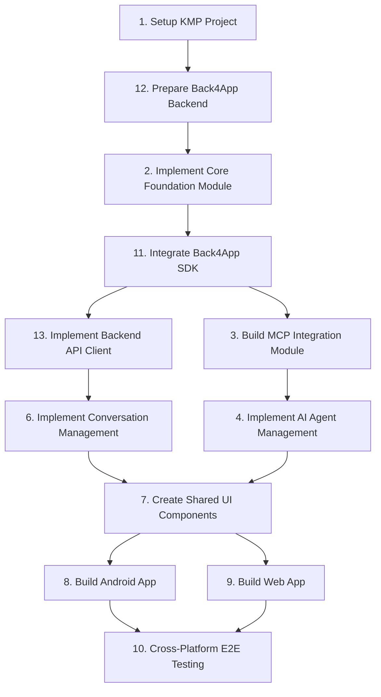

# Project Plan: CariAku Mobile 2.0 (Revised)

This document outlines the definitive, architecturally-sound development plan for CariAku Mobile 2.0. The plan has been revised to incorporate a backend-centric architecture with Back4App.

## Development Sequence

The following is the correct execution order for the project's high-level tasks. The task IDs are not sequential due to architectural revisions, but the dependency chain is correct and dictates the build order.

## Task Breakdown

1.  **Task 1: Setup Kotlin Multiplatform Project Structure**
2.  **Task 12: Prepare Back4App Backend and Schema**
3.  **Task 2: Implement Core Foundation Module**
4.  **Task 11: Integrate Back4App SDK for Configuration Fetching**
5.  **Task 13: Implement Backend API Client**
6.  **Task 3: Build MCP Integration Module**
7.  **Task 4: Implement AI Agent Management System**
8.  **Task 6: Implement Conversation Management Module**
9.  **Task 7: Create Shared UI Components using Compose Multiplatform**
10. **Task 8: Build and Integrate Android Application**
11. **Task 9: Build and Integrate Web Application (PWA)**
12. **Task 10: Perform Cross-Platform E2E Testing and Optimization**