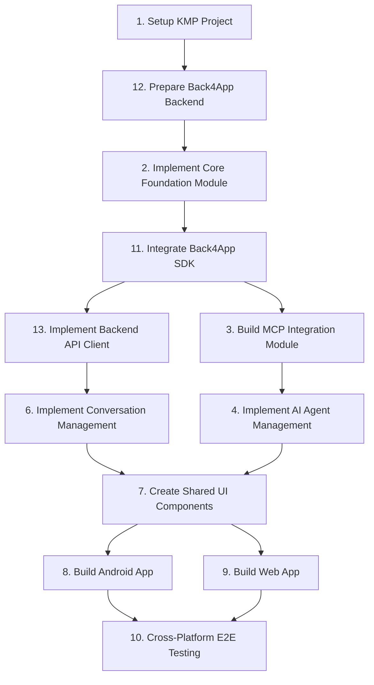

# CariAku Mobile 2.0 - MCP-Enabled AI Agent Platform

This project aims to build a sophisticated AI agent platform that leverages the Model Context Protocol (MCP) for dynamic tool discovery and integration. It will provide domain-specific AI agents accessible through a unified chat interface across Android and Web platforms.

## Project Overview

The platform is designed to address the limitations of current AI assistants by enabling agents to dynamically acquire and utilize specialized tools through standardized protocols. This allows for a more powerful and flexible AI experience, catering to specific user needs in areas like trading, research, and analysis.

## Key Capabilities

*   **MCP Integration**: Dynamic discovery, configuration, and execution of MCP tools.
*   **AI Agent Management**: Creation, configuration, and lifecycle management of specialized AI agents.
*   **Intelligent Routing**: Routing user requests to appropriate agents via n8n integration and task-based logic.
*   **Conversation Management**: Unified chat interface with context preservation across agents.
*   **Cross-Platform UI**: Consistent user experience across Android and Web platforms using Compose Multiplatform.

## Project Plan & Task Breakdown

The project is structured into phases, with detailed tasks and dependencies managed by Taskmaster. The following is the final, architecturally-sound execution order:

### Task List:

| ID | Title                                                              | Status      | Priority | Dependencies | Complexity |
|----|--------------------------------------------------------------------|-------------|----------|--------------|------------|
| 1  | Setup Kotlin Multiplatform Project Structure                       | ○ pending   | high     | None         | ● 4        |
| 12 | Prepare Back4App Backend and Schema                                | ○ pending   | medium   | 1            | ● 3        |
| 2  | Implement Core Foundation Module                                   | ○ pending   | high     | 1            | ● 5        |
| 11 | Integrate Back4App SDK for Configuration Fetching                  | ○ pending   | high     | 2, 12        | ● 6        |
| 13 | Implement Backend API Client                                       | ○ pending   | medium   | 2, 11        | ● 6        |
| 3  | Build MCP Integration Module                                       | ○ pending   | high     | 11           | ● 6        |
| 4  | Implement AI Agent Management System                               | ○ pending   | high     | 3            | ● 7        |
| 6  | Implement Conversation Management Module                           | ○ pending   | high     | 4            | ● 5        |
| 7  | Create Shared UI Components using Compose Multiplatform            | ○ pending   | medium   | 6            | ● 5        |
| 8  | Build and Integrate Android Application                            | ○ pending   | medium   | 7            | ● 7        |
| 9  | Build and Integrate Web Application (PWA)                          | ○ pending   | medium   | 7            | ● 5        |
| 10 | Perform Cross-Platform E2E Testing and Optimization                | ○ pending   | medium   | 8, 9         | ● 8        |

<!-- TASKMASTER_EXPORT_START -->
> 🎯 **Taskmaster Export** - 2025-10-25 11:07:22 UTC
> 📋 Export: without subtasks • Status filter: none
> 🔗 Powered by [Task Master](https://task-master.dev?utm_source=github-readme&utm_medium=readme-export&utm_campaign=cam&utm_content=task-export-link)

| Project Dashboard |  |
| :-                |:-|
| Task Progress     | ██░░░░░░░░░░░░░░░░░░ 8% |
| Done | 1 |
| In Progress | 0 |
| Pending | 11 |
| Deferred | 0 |
| Cancelled | 0 |
|-|-|
| Subtask Progress | ░░░░░░░░░░░░░░░░░░░░ 0% |
| Completed | 0 |
| In Progress | 0 |
| Pending | 45 |

| ID | Title | Status | Priority | Dependencies | Complexity |
| :- | :-    | :-     | :-       | :-           | :-         |
| 1 | Setup Kotlin Multiplatform Project Structure | ✓&nbsp;done | high | None | ● 4 |
| 2 | Implement Core Foundation Module | ○&nbsp;pending | high | 1 | ● 5 |
| 3 | Build MCP Integration Module | ○&nbsp;pending | high | 11 | ● 6 |
| 4 | Implement AI Agent Management System | ○&nbsp;pending | high | 3 | ● 7 |
| 6 | Implement Conversation Management Module | ○&nbsp;pending | high | 4 | ● 5 |
| 7 | Create Shared UI Components using Compose Multiplatform | ○&nbsp;pending | medium | 6 | ● 5 |
| 8 | Build and Integrate Android Application | ○&nbsp;pending | medium | 7 | ● 7 |
| 9 | Build and Integrate Web Application (PWA) | ○&nbsp;pending | medium | 7 | ● 5 |
| 10 | Perform Cross-Platform E2E Testing and Optimization | ○&nbsp;pending | medium | 8, 9 | ● 8 |
| 11 | Integrate Back4App SDK for Configuration Fetching | ○&nbsp;pending | high | 2, 12 | ● 6 |
| 12 | Prepare Back4App Backend and Schema | ○&nbsp;pending | medium | 1 | ● 3 |
| 13 | Implement Backend API Client | ○&nbsp;pending | medium | 2, 11 | ● 6 |

> 📋 **End of Taskmaster Export** - Tasks are synced from your project using the `sync-readme` command.
<!-- TASKMASTER_EXPORT_END -->

